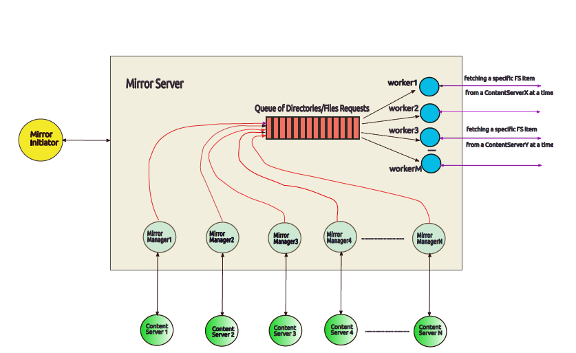

# Selective Overhead Mirroring
This mirroring system consists of a series of web-based programs that all achieve the desired file transfer. Individual programs should use threads to achieve data transfer.

## Description
The figure at the bottom shows the organization and interaction of programs involved in the implementation of the system. The Internet Client Program "MirrorInitiator" can communicate with a MirrorServer on any machine by providing not only the devices but also specific elements of the corresponding file systems.

The user of MirrorInitiator quotes the MirrorServer and one or more ContentServers web addresses as parameters, along with a delay tolerance parameter that should be demonstrated by each ConteServer that participates in mirroring.

MirrorServer receives through the network connection the information about the remote devices from which he retrieves the files with the help of threads that we call MirrorManagers. Finally, with the help of a fixed number of worker type threads, MirrorServer transfers to the local storage space the files of the remote devices.

The remote devices will run the ContentServer program, which is responsible for servicing applications from the MirrorServer with regard to the list of available files / directories as well as the transfer of the individual files.

## Compilation:
	$make
	($make clean for file clean)
	
## Run(example):
	./MirrorInitiator -n 192.168.1.9 -p 1121 -s 192.168.1.9:1050:feels.jpg:2,192.168.1.9:1051:src:1,192.168.1.9:1052:home:3
    ./MirrorServer -p 1121 -w 3 -m ~/Desktop/Results 
    ./ContentServer -p 1050 -d ~/Pictures
    ./ContentServer -p 1051 -d ~/Desktop
    ./ContentServer -p 1052 -d ~/Downloads
	
(All tests involving the ContentServers have been under the IPV4 address of the same computer) 
